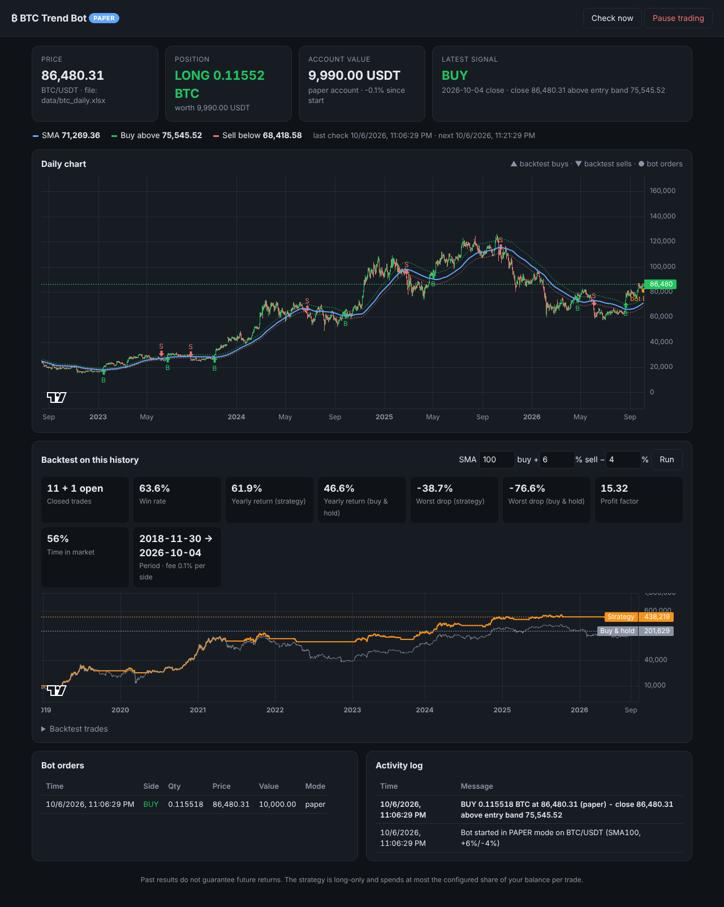

# Binance Order Book Scalper

A bot that scalps any Binance spot pair you type in (`BTCUSDT`, `ETHBTC`,
`SOLUSDT`…). It reads the live order book and trade flow and buys when
short-term buying pressure builds. It sells at a take-profit worth **at
least 0.12% after fees**, or exits early to cut a loss. It runs on your
own Windows PC, with a dashboard in your browser.



> **Read this first.** Scalping is one of the hardest ways to make money in
> trading. Every trade pays the fee twice, so the bot must be right far more
> often than it is wrong. **No version of this strategy has been proven
> profitable**: it could not be backtested, because historical order book
> data was not available. Run it in **paper mode** for days, look at the
> results on the dashboard, and only then decide whether to risk real money,
> starting small.

## How it trades

Every 0.2 seconds the bot scores the market from **−1 (selling pressure)
to +1 (buying pressure)** by combining three readings:

| Reading | What it measures |
|---|---|
| **Book imbalance** | Resting buy vs sell volume within 0.10% of the price. Closer levels count more, so far-away "walls" matter less. |
| **Microprice skew** | Where the size-weighted price sits inside the spread. A thin ask over a thick bid means the next move is likely up. |
| **Trade flow** | Aggressive buying vs selling (market orders) over the last 30 seconds. |

**It buys only when all of these are true:**
* The score is **≥ +0.35 for 2 seconds** in a row.
* The spread is ≤ 5 bps, so the market is liquid enough.
* At least 10 trades happened in the last 30 seconds.
* The average 1-minute candle range is at least 1.5× the move needed for the take-profit, so the target can realistically be reached.
* Price is above the 1-minute EMA(20). This trend filter is optional.
* No risk limit has been hit (see below).

**The trade:**
1. **Buy:** a post-only limit order at the best bid, or one tick better.
   It pays the cheaper maker fee and never crosses the spread. If it
   isn't filled within 15 s, or the signal fades, it is cancelled.
2. **Take-profit:** as soon as the buy fills, a post-only limit sell is
   placed at the price that nets **≥ 0.12% after both fees**. With
   Binance's standard 0.10% fees, that is about **+0.32%** above the entry
   price; with the BNB discount (0.075%), about +0.27%. The bot reads your
   actual fee rates from Binance.
3. **Early exit at market** if any of these happen:
   * **stop loss:** price falls 0.30% below entry;
   * **time limit:** 5 minutes have passed;
   * **book turned bearish:** the score stays ≤ −0.40 for 3 seconds;
   * **manual:** you press **Close trade**.

**What a loss costs:** a stop-loss exit loses about 0.30% plus fees, or
roughly −0.5% in total. A win nets +0.12% or more. The bot therefore needs
to win around 4 trades out of 5 just to break even. Raising
`min_profit_pct` or tightening the stop changes that balance, and the
dashboard's **Performance** panel shows how your settings are actually
doing.

**Long only:** spot accounts can't short, so the bot only buys and then
sells. On `ETHBTC` it buys ETH with BTC and sells it back for more BTC.

### Risk limits (all in Settings)
* **Order size:** how much quote coin each buy uses (USDT for BTCUSDT, BTC for ETHBTC).
* **Max trades per hour:** 30.
* **Max daily loss:** trading stops for the day after this loss (in quote coin).
* **Losses in a row:** after 4 losing trades in a row, trading pauses until you press Start.
* **Always starts paused:** after a restart or a symbol change, it waits for you to press Start.

## Install on Windows

1. Install **Python 3.11 or newer** from
   [python.org/downloads](https://www.python.org/downloads/). In the
   installer, tick **"Add python.exe to PATH"**.
2. Download this repository: on GitHub, use **Code → Download ZIP**, then
   unzip it, for example to `C:\scalper`.
3. Double-click **`start.bat`**. On the first run it sets up the Python
   packages (about a minute), creates a `.env` settings file, and opens
   the dashboard at <http://127.0.0.1:8080>.
4. Type a symbol (e.g. `BTCUSDT`) at the top, press **Switch**, then
   **Start**.

You are now **paper trading**: the bot uses real Binance prices but fake
money, and fills its orders by watching real trades go through its price.
Closing the black window stops the bot.

## Connect your Binance account

1. **Make a key:** in Binance open **Profile → API Management → Create API
   → System generated**, then edit its restrictions:
   * **Enable Spot & Margin Trading:** ON.
   * **Enable Withdrawals:** OFF. The bot refuses to start if this is on.
     Even a stolen key can then never move money out of your account.
   * **Restrict access to trusted IPs:** turn it on with your home IP if
     your internet provider gives you a fixed IP. If your IP changes, the
     bot can't connect until you update it.
2. **Try the Testnet first (recommended):** log in at
   [testnet.binance.vision](https://testnet.binance.vision) with GitHub and
   generate a key there. You get fake funds on a real copy of Binance's
   matching engine.
3. **Edit `.env`** with Notepad:
   ```ini
   MODE=live
   TESTNET=true          # false = your real account
   API_KEY=...
   API_SECRET=...
   ```
4. **Restart:** close the window and double-click `start.bat` again. The
   mode badge shows **TESTNET** or **LIVE**. Real-money mode asks you to
   confirm when you press Start.

Fund your Spot wallet with the quote coin (USDT for BTCUSDT, BTC for
ETHBTC). Each order must be above Binance's minimum (usually 5 USDT, or the
equivalent); the dashboard tells you if your order size is too small.

## Keeping it running on a PC

* **Sleep:** the bot stops Windows from going to sleep while it runs (the
  screen can still turn off). Don't close the black window.
* **Windows Update restarts:** pause updates while trading, or set active
  hours.
* **If the PC or internet drops:**
  * An unfilled buy order is cancelled on the next start.
  * A take-profit sell already on Binance stays there. The bot picks it up
    again when it restarts.
  * While the bot is off, there is **no stop loss**.
* **Clock:** Binance rejects requests if your PC clock is off by more than a
  few seconds. In Windows Settings, open **Time & language → Date & time**
  and click **Sync now**.
* **Region:** Binance.com doesn't serve some countries, including the USA.
  There the connection fails with error 451.

## Security

* **Local only:** the dashboard listens only on `127.0.0.1`. Other devices
  on your network or the internet can't reach it, and the bot refuses to
  start if `HOST` is changed. Don't port-forward it.
* **Other websites can't use it:** requests from web pages on other sites
  are rejected, using a Host check, a custom request header and an Origin
  check. Strict security headers are set.
* **Keys stay on your PC:** your keys live only in `.env` and are sent only
  to Binance. Keep `.env` private, and never share or upload it.

## Troubleshooting

| Message | Fix |
|---|---|
| `451` / "restricted location" | Binance.com is not available from your country / IP |
| `-1021` timestamp | Sync your Windows clock (see above) |
| `-2015` invalid API key, IP or permissions | Wrong key, testnet key on live (or vice versa), or your IP isn't in the key's trusted list |
| "order size is below Binance's minimum" | Raise **Order size** in Settings |
| "1m range … needed" | The pair is too quiet to reach the target. Pick a more active pair, or lower **1m range ≥ target ×** |
| "spread … bps" | The pair's spread is too wide for scalping |

## For developers

```
scalper/book.py      order book metrics: spread, microprice, imbalance
scalper/flow.py      trade flow and 1-minute candles
scalper/signals.py   score, filters, confirmation timer
scalper/trader.py    the trade state machine and risk limits
scalper/brokers.py   PaperBroker (simulated fills) and BinanceBroker (ccxt)
scalper/feed.py      Binance websocket streams (depth20@100ms, aggTrade, kline_1m)
scalper/engine.py    wires everything for the selected symbol
scalper/web.py       local dashboard API
run.py, start.bat    launcher
```

* **Tests:** `pip install -r requirements-dev.txt && pytest`
* **Offline demo:** `FEED=demo` in `.env` runs the dashboard on a synthetic
  market, for UI testing only. Its results mean nothing. `DEMO_PRICE` and
  `DEMO_TICK` mimic other coins, e.g. `DEMO_PRICE=0.35` and
  `DEMO_TICK=0.0001` for a low-priced coin like ARK.
